# Carryover

**Your safe path to migrate.** Carryover is a fraud-protection and visa-guidance
platform for migrants — built for people from East Africa, South Asia, and West
Africa who are targeted by fake "guaranteed visa" agencies.

Built for the **Google Cloud Rapid Agent Hackathon — Elastic track**, powered by
**Gemini** and **Elastic Agent Builder**.

---

## What it does

Carryover runs a team of AI agents, orchestrated by **Kibo**:

- **Advisor** — answers what an official visa actually requires (name, fee,
  funds, processing time, documents, steps) for any nationality → destination →
  purpose, grounded in official government sources with citations.
- **Inspector** — checks whether an agency is a scam. Paste a suspicious offer,
  or give Kibo a Telegram agency handle, and it pulls the channel's posts, scores
  them for fraud signals, cross-checks claims against official policy, and flags
  phone numbers reused across multiple agencies.
- **Kibo (orchestrator)** — Gemini decides which specialists handle a request,
  runs them, and synthesizes the result. Confirmed scams and scanned agencies are
  written **back** into Elasticsearch, so every check makes the system smarter.

## Architecture

```mermaid
flowchart LR
    user([User]) --> fe["React + Vite frontend\n(nginx)"]
    fe -- "/api/*" --> api["FastAPI backend"]

    subgraph orch ["Kibo — orchestrator"]
        api --> kibo{"Gemini router"}
        kibo --> advisor["Advisor\nofficial visa policy"]
        kibo --> inspector["Inspector\nfraud detection"]
        kibo --> reporter["Reporter\nwarnings + complaints"]
    end

    advisor -- "ELSER semantic search" --> es[("Elasticsearch\nvisa-policies · known-scams\nagency-posts · structured-policies")]
    inspector -- "ELSER + ES&#124;QL identity reuse" --> es
    reporter -- "community write-back" --> es
    reporter -- "complaint email" --> resend["Resend"]
    kibo <--> gemini["Gemini\nrouting · synthesis · grounding"]

    subgraph ingest ["Ingestion"]
        crawler["Elastic Open Crawler\n(official gov sites)"] --> es
        telegram["Telegram agency channels"] --> es
        cfpb["CFPB fraud database"] --> es
        firecrawl["Firecrawl\n(news + enrichment)"] --> es
    end
```



Every chat turn flows **frontend → Kibo → Gemini routing → specialist agents →
Elasticsearch → Gemini synthesis**, and confirmed scams are written back into
Elasticsearch so the next check is smarter.

## How it uses the partner tech

**Elastic** is the system of record and the search/agent layer:

- **Elastic Agent Builder** — the Inspector and Advisor agents and **8 custom
  tools** (semantic search, ES|QL analytics, identity-reuse detection) live in
  Agent Builder and are exposed to Gemini through the **Agent Builder MCP server**.
- **ELSER** — semantic search over visa policies and known-scam patterns
  (`semantic_text` fields).
- **ES|QL** — identity-reuse detection (phones/handles shared across agencies)
  and corridor/trend analytics.
- **Elastic Open Crawler** — scheduled ingestion of official immigration/embassy
  pages into Elasticsearch.
- **Agent memory write-back** — user scam reports and agency scans flow back into
  Elasticsearch.

**Google Cloud / Gemini** is the reasoning layer: agent routing, synthesis,
structuring messy government text into clean policy, and **Google Search
grounding** to fill routes with no indexed data.

## Data (~12,000 docs across six indices)

Ingested from five sources, all searched in Elasticsearch:

| Index | Docs | Source |
| --- | --- | --- |
| `crawled-visa-pages` | ~5,100 | Elastic Open Crawler (official gov sites) |
| `visa-policies` | ~2,760 | Crawler → processed + ELSER (semantic) |
| `agency-posts` | ~2,600 | Live Telegram agency channels (Firecrawl-discovered) |
| `known-scams` | ~1,350 | CFPB public consumer-fraud database + ELSER |
| `structured-policies` | ~30 | Gemini structuring + Firecrawl + Google-Search grounding |
| `visa-news` | live | Firecrawl news search |

> Note: Firecrawl and the CFPB database are supplementary **ingestion** sources;
> Elasticsearch is the single store the agents search.

## Tech stack

- **Frontend:** React + TypeScript + Vite + Tailwind
- **Backend:** FastAPI (Python)
- **AI:** Gemini (Google), Elastic Agent Builder + MCP, ELSER, ES|QL
- **Ingestion:** Elastic Open Crawler, Firecrawl, CFPB API

## Running locally

### 1. Prerequisites
- An **Elasticsearch (Search) Serverless** project (Agent Builder requires the
  Search project type, not Observability).
- A Gemini API key.
- Python 3.11+, Node 18+.

### 2. Configure `.env` (repo root)
```
ELASTICSEARCH_URL=https://<your-project>.es.<region>.gcp.elastic.cloud
ELASTICSEARCH_API_KEY=<encoded key>
KIBANA_URL=https://<your-project>.kb.<region>.gcp.elastic.cloud
AGENT_BUILDER_API_KEY=<encoded key>
GEMINI_API_KEY=<your gemini key>
```

### 3. Backend
```bash
python -m venv .venv && source .venv/bin/activate
pip install -r backend/requirements.txt
cd backend && uvicorn app.main:app --host 0.0.0.0 --port 8001 --reload
```

### 4. Register Elastic indices, tools, and agents
```bash
curl -X POST http://localhost:8001/api/setup
```
This creates the indices and registers the 8 Agent Builder tools + the Advisor
and Inspector agents (visible in Kibana → Agents).

### 5. Frontend
```bash
cd frontend && npm install && npm run dev
```
Open http://localhost:5173.

### 6. (Optional) Load data
```bash
python scripts/seed_policies.py            # curated seed policies
python scripts/firecrawl_enrich.py         # Firecrawl-verified fees/funds
python scripts/ingest_telegram_channels.py # agency channels
python scripts/ingest_cfpb_api.py          # CFPB fraud narratives
# Crawl official pages (requires Docker):
bash crawler/run_all.sh
```

## Deploying on EasyPanel

Both services build from this repo — each has its own `Dockerfile`
([backend/Dockerfile](backend/Dockerfile), [frontend/Dockerfile](frontend/Dockerfile)).
The frontend's nginx proxies `/api/*` to the backend inside the project network,
so only the frontend needs a public domain and no CORS setup is required.

### 1. Backend service
Project → **+ Service → App**, name it **`backend`**:

| Tab | Setting | Value |
| --- | --- | --- |
| Source | GitHub repo | `yordanoskassa/carryover`, branch `main` |
| Source | Build path | `/backend` |
| Build | Builder | **Dockerfile** (path `./Dockerfile`) |
| Domains | — | none needed (internal-only) |

**Environment** tab:
```
ELASTICSEARCH_URL=https://<your-project>.es.<region>.gcp.elastic.cloud
ELASTICSEARCH_API_KEY=<encoded key>
KIBANA_URL=https://<your-project>.kb.<region>.gcp.elastic.cloud
AGENT_BUILDER_API_KEY=<encoded key>
GEMINI_API_KEY=<your gemini key>

# optional — Reporter email delivery (without it, complaints stay as drafts)
RESEND_API_KEY=<resend key>
REPORT_TO_EMAIL=<inbox that receives complaints>
```

### 2. Frontend service
**+ Service → App**, name it **`frontend`**:

| Tab | Setting | Value |
| --- | --- | --- |
| Source | GitHub repo | same repo, branch `main` |
| Source | Build path | `/frontend` |
| Build | Builder | **Dockerfile** (path `./Dockerfile`) |
| Domains | Domain | your domain (or let EasyPanel generate one), **proxy port 80**, HTTPS on |

**Environment** tab:
```
BACKEND_URL=https://anton-carryover.hrvnvm.easypanel.host
```
Point `BACKEND_URL` at the backend's public URL (as above), or keep traffic
inside the project network with `http://backend:8001` (services in the same
project resolve each other by service name; use
`http://<project>_<service>:8001` if the plain name doesn't resolve).

### 3. First-time setup
After both services deploy, register the indices, tools, and agents once:
```bash
curl -X POST https://<your-domain>/api/setup
```

To redeploy on every push, enable **Auto Deploy** in each service's GitHub
settings (or add the deploy webhook to the repo).

## Known follow-ups
- Versioned index names + aliases for zero-downtime reindexing.
- Route Gemini's tool calls through the Agent Builder MCP server end-to-end.

## License
MIT — see [LICENSE](LICENSE).
